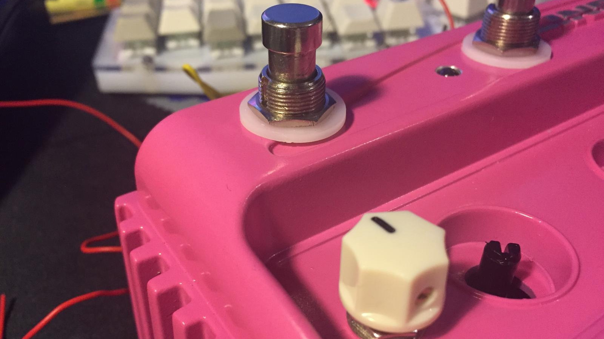
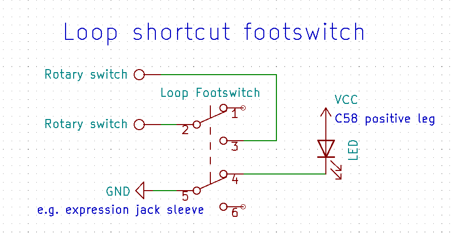

# 🧨 Disassembly


Remove the potentiometer knobs by pulling or carefully prying with a flathead screwdriver.

Undo the jack nuts.


Unscrew the five screws on the bottom.


Remove the four screws and the hex standoff.

Desolder the battery cables and remove the battery contacts to make room for the external tap tempo jack and the expression knob.


Lift the PCB out by the front (standoff side) edge.

<br>

# 🔩 Switch Replacement

<br>


<br>

| Parts needed | Qty |
| --- | --- |
| Momentary SPST footswitch | 4 |

<br>

Desolder or destroy the original tactile switches.


Remove the old switch bodies by undoing the nut on the outside.

Remove nubs in switch holes with e.g. a file, rotary tool or a 12mm / 1/2" drill bit.


Install the switches without the nut or washers on the inside.


Wire the new switches to the pads of the tactile switches, one wire on either of the top pads, one wire on a bottom pad. (The top pads are connected to each other and so are the bottom ones)


<br>

# 💡 Led Replacement ⚠

| Parts needed | Qty |
| --- | --- |
| 3mm/5mm LEDs | 4 |

<br>

Desolder the old LEDs.


Using the spacers from the old LEDs, install the new LEDs aligning the longer leg of the LED with the + on the PCB.


If using 5mm LEDs you might have to drill the holes in the enclosure to match.

```
pic of leds
```

<br>

# 📚 WIP Double Presets Footswitch WIP

<br>

NOT FULLY FUNCTIONAL YET

This mod adds a bank of presets by acting like an expression pedal in full heel or toe position.

<br>

| Parts needed | Qty |
| --- | --- |
| Latching SPST footswitch | 1 |
| 10K resistor | 1 |
| LED | 1 |
| LED holder | 1 |

<br>


Marking the holes is easier if you fit the white footswitch washer in the recess away from the center, then find the center. This way the switches shouldn't conflict with the jacks.

You might have to resolder C15 flat if it touches the switch.


Somebody somewhere said one should isolate the switching tip contact of the expression pedal jack, for example by sticking tape between the contacts. 


If you're not using the toggle switch to choose between double presets / expression knob, solder the wire from the footswitch to the expression jack tip.


You can solder the wire marked 'Expression Jack Sleeve' to any of these points.


<br>

# 💨 WIP Expression Knob WIP

<br>

NOT FULLY FUNCTIONAL YET

The expression knob works like an external expression pedal would.

<br>

| Parts needed | Qty |
| --- | --- |
| 10K linear potentiometer | 1 |
| Potentiometer knob | 1 |

<br>


Drill a hole for the potentiometer on an end of the battery bay approx. 20mm from the front edge and 18mm from the bottom, or whatever dimensions suit your knob.


Somebody somewhere said one should isolate the switching tip contact of the expression pedal jack, for example by sticking tape between the contacts. 


If you're not using the toggle switch to choose between double presets / expression knob, solder the wire from the potentiometer to the expression jack tip.


You can wire the ground to a bottom pad of of a switch.


<br>

# 💱 WIP Switching between double presets and expression knob WIP

<br>

NOT FULLY FUNCTIONAL YET

As the title implies, this switch switches between the double preset footswitch and the expression knob.

<br>

| Parts needed | Qty |
| --- | --- |
| SPDT toggle switch | 1 |

<br>


Solder the wire from the toggle switch to the expression jack tip.


<br>

# 🎶 External Tap Tempo
[Source](https://web.archive.org/web/20110130235011/http://kyleagee.com/?page_id=105)

<br>

The external tap tempo jack allows you to connect a separate switch box via a basic guitar/patch cable.

<br>

| Parts needed | Qty |
| --- | --- |
| Mono jack | 1 |

<br>


Drill a hole for the jack on the end of the battery bay approx. 20mm from the front edge and 14mm from the bottom


The jack is installed parallel to the tap tempo switch, connecting the jack's tip to a top pad of the switch, sleeve on a bottom pad.


<br>

# 💫 WIP Feedback Loop WIP
[Source](https://web.archive.org/web/20101130103726/http://experimentalistsanonymous.com/board/index.php?topic=82.msg3557)

<br>

NOT FULLY FUNCTIONAL YET

This mod adds a footswitchable feedback loop with an optional potentiometer in series to control the amount of feedback.

<br>

| Parts needed | Qty |
| --- | --- |
| Momentary or latching SPST footswitch | 1 |

| Optional | Qty |
| --- | --- |
| 1M potentiometer | 1 |
| Potentiometer knob | 1 |

<br>


You can barely fit another footswitch above the power jack. Below it is a nice spot for the feedback amount potentiometer if you don't mind a hole in the preset texts.



Here the wires are soldered to the left input jack tip and the left output jack tip.


<br>

# 🔊 Volume Drop Fix
[Source](https://web.archive.org/web/20201027203217/https://www.harmonycentral.com/forums/topic/119557-line-6-mm4dl4-volume-fix-without-using-smt-resistors/)

<br>

Some people experience a problem with volume drop. This mod increases the gain of the output buffers fixing the issue.

<br>

| Parts needed | Qty |
| --- | --- |
| 22K-24K resistor | 2 |
| or |
| 56K-68K resistor | 2 |

<br>

Either remove R36 and R37 and replace with 22K-24K resistors, or solder 56K-68K resistors parallel to the original resistors.


<br>

# ⭕ Looper Shortcut Footswitch
[Source](https://web.archive.org/web/20200301050201/http://www.pedalhaven.com/line-6-dl4-mods-looper-switch/)

<br>

The looper shortcut footswitch allows you to switch between the delay and the looper setting via a footswitch.

<br>

| Parts needed | Qty |
| --- | --- |
| Latching SPST footswitch | 1 |

| Optional | Qty |
| --- | --- |
| LED | 1 |
| LED holder | 1 |

<br>



Cut the leftmost leg in the middle and bend the remaining stubs outward.


Solder the wires from the footswitch to each end of the cut rotary switch leg.


We can tap into the 3.3V rail from the positive leg of C58 to power the LED.


Red is LED's positive wire, black is negative and goes to the switch.


